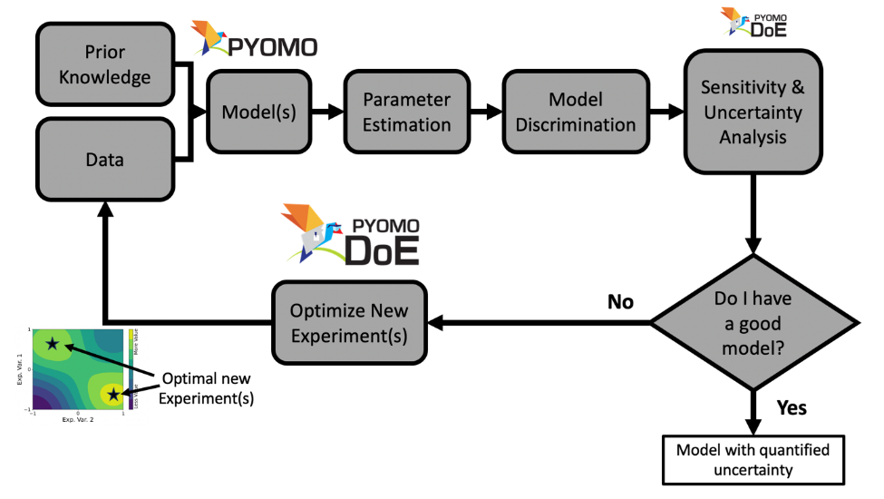

# Optimizing Experiments with Pyomo.DoE

Welcome to the interactive tutorial workshop for parameter estimation and model-based design of experiments in the Pyomo ecosystem!



These materials were created by [Prof. Alexander Dowling](https://dowlinglab.nd.edu/people/professor-alexander-w-dowling/), [Dr. Dan Laky](https://dowlinglab.nd.edu/people/daniel-laky/), [Shammah Lilonfe](https://dowlinglab.nd.edu/people/shammah-lilonfe/), [Stephen Cini](https://dowlinglab.nd.edu/people/stephen-cini/), [Shuvo Mondal](https://dowlinglab.nd.edu/people/shuvashish-mondal/), and [Dr. Shilpa Narasimhan](https://dowlinglab.nd.edu/people/dr-shilpa-narasimhan/) at the University of Notre Dame. 


Special thanks to [Prof. Jeff Kantor](https://engineering.nd.edu/news/in-memoriam-jeffrey-kantor-former-vice-president-associate-provost-and-dean/), [Maddie Watson](https://dowlinglab.nd.edu/people/madelynn-watson/), [Molly Dougher](https://dowlinglab.nd.edu/people/molly-dougher/), and [Hailey Lynch](https://dowlinglab.nd.edu/people/hailey-lynch/) for assistance with the TCLab models and activities.

ParmEst and Pyomo.DoE were developed by (in alphabetic order): [Stephen Cini](https://dowlinglab.nd.edu/people/stephen-cini/), [Prof. Alexander Dowling](https://dowlinglab.nd.edu/people/professor-alexander-w-dowling/), [Katherine Klise](https://scholar.google.com/citations?user=Rv5DAzAAAAAJ&hl=en), [Dan Laky](https://dowlinglab.nd.edu/people/daniel-laky/), [Shammah Lilonfe](https://dowlinglab.nd.edu/people/shammah-lilonfe/), [Shawn Martin](https://scholar.google.com/citations?user=nCT_-C8AAAAJ&hl=en), [Shuvo Mondal](https://dowlinglab.nd.edu/people/shuvashish-mondal/), [Miranda Mundt](https://ieeexplore.ieee.org/author/37089520396), [Shilpa Narasimhan](https://dowlinglab.nd.edu/people/dr-shilpa-narasimhan/), [Bethany Nicholson](https://scholar.google.com/citations?user=WxqNQ6IAAAAJ&hl=en), [John Siirola](https://www.sandia.gov/ccr/staff/john-daniel-siirola/), and [Jialu Wang](https://dowlinglab.nd.edu/people/jialu-wang/).

## American Control Conference (ACC) 2026 Workshop

**Model Building and Digital Twin Construction using Pyomo.DoE, a Pythonic Tool for Optimal Experimental Design**

Digital twins rely on high-quality data to achieve predictive capability, yet experiments are often expensive and constrained. Optimal experimental design (OED) provides a principled framework for selecting experiments that maximally reduce model uncertainty, and can be naturally posed as an optimal control problem constrained by dynamic system models and experimental limitations.
This workshop introduces Pyomo.DoE, an open-source, Python-based, equation-oriented framework for model building and optimal experimental design within the Pyomo modeling ecosystem. Participants will learn how classical information-based design criteria, including D-, A-, E-, and ME-optimality derived from the Fisher Information Matrix, can be embedded in nonlinear dynamic optimization problems and solved using modern numerical optimization tools. The formulation treats experimental inputs (e.g., control trajectories, sampling times, operating conditions) as decision variables in an optimal control problem that explicitly balances information gain and experimental feasibility.

The workshop will begin with a brief introduction to algebraic modeling and dynamic optimization in Pyomo, followed by a hands-on workflow for parameter estimation, uncertainty quantification, and optimal experiment design. Through interactive examples, participants will construct predictive models, design informative experiments, and explore how different optimality criteria target distinct sources of uncertainty.

This workshop is intended for researchers and practitioners interested in digital twins, system identification, and model-based experiment design. The workshop highlights how modern computational optimization tools enable scalable, rigorous, and automated experimental design for complex dynamic systems.

[*Register Here*](https://acc2026.a2c2.org/registration)

We are scheduled for a [half-day afternoon workshop](https://acc2026.a2c2.org/program/workshop-listing#session-6-17) on **Tuesday, May 26, 2026**. The schedule below assumes a 1pm start time and will be updated once the conference schedule is finalized.

| Time | Topic |
| ---- | -------- |
| noon  | *Welcome, Overview, and Computer Setup* |
| 12:15 pm | **Part 1: Dynamic Modeling and Optimization in Pyomo** |
| | [TC Lab Model](./notebooks/tclab_model.ipynb) |
| | [Numpy Simulation](./notebooks/numpy_simulation.ipynb) |
| | [Simulation in Pyomo](./notebooks/pyomo_simulation.ipynb) |
| | [Experiment Abstraction](./notebooks/experiment_abstraction.ipynb) |
| | Hands-on Examples |
| 1:30 pm | *Short Break* |
| 1:45 pm | **Part 2: Parameter Estimation** |
| | [ParmEst Overview](./notebooks/parmest.ipynb) |
| | [Uncertainty Quantification](./notebooks/parmest_uncertainty_quantification.ipynb) |
| | [Multistart Profile Likelihood](./notebooks/parmest_multistart_profilelikelihood.ipynb) |
| | [Regularization](./notebooks/parmest_regularization.ipynb) |
| | Hands-on Examples | 
| 3:00 pm | *Coffee Break* |
| 3:30 pm | **Part 3: Optimal Experiment Design** |
| | [Pyomo.DoE Overview](./notebooks/doe_optimize.ipynb) |
| | [Objective Choices](./notebooks/doe_optimize_objectives.ipynb) |
| | [Symbolic Derivatives](./notebooks/doe_optimize_symbolic.ipynb) |
| | [Multiple Experiments](./notebooks/doe_multiexperiment.ipynb) |
| | Hands-on Examples |
| 5:00 pm | *Adjourn* |

## What will I learn in this workshop?

In this workshop, we will learn how to develop digital twin models in the open-source Pyomo ecosystem. Specifically, we will learn how to use three Pyomo-based toolkits:
* `pyomo.dae` for modeling and discretization of (partial) differential algebraic equations to facilitate dynamic optimization
* `ParmEst` for parameter estimation and uncertainty quantification
* `Pyomo.DoE` for model-based design of experiments

## What do I need to complete the tutorial?

This tutorial assumes the audience is familiar with basic Python programming. (New to Python? Check out [this](https://lectures.scientific-python.org/index.html) and similar online resources.) The tutorial is designed to run in Google Colab. The `tclab_pyomo.py` file contains the Pyomo model for our motivating system as well as utilities to install software on Colab.

Alternatively, participants can run the tutorial locally on their computer. Use the following command to create a new conda environment:

```
conda create -n summer2026 -c conda-forge -c IDAES-PSE python=3.11 idaes-pse pandas numpy matplotlib scipy ipykernel pip
```

Activate the environment:

```
conda activate summer2026
```

Then install the optimization solvers, including `Ipopt` with HSL linear algebra and `k_aug`:

```
idaes get-extensions
```

Note: `k_aug` is not distributed for macOS users with an Intel processor. Instead, you will either need to compile it yourself or skip a few sections of the tutorial. `k_aug` is an optional dependency for `Pyomo.DoE`.

Finally, we need reinstall Pyomo with a specific version with new Pyomo.DoE features:

```
python -m pip install --no-deps --force-reinstall "pyomo @ git+https://github.com/dowlinglab/pyomo.git@pyomo-doe-workshop-2026"
```

These features are currently under review and should be included in the next Pyomo release. Once this happens, we will update these workshop install instructions to use the newest released version of Pyomo.

Next, download the files for this tutorial:

```
git clone git@github.com:dowlinglab/pyomo-doe.git
```

Developer and maintainer setup instructions are documented in [DEVELOPER.md](./DEVELOPER.md).

## How do I learn more about Pyomo.DoE?

The [Pyomo.DoE documentation](https://pyomo.readthedocs.io/en/stable/contributed_packages/doe/doe.html) is a great resource and includes a different set of examples. You can also go through our reaction kinetics example, which is split into the [experiment abstraction](https://github.com/Pyomo/pyomo/blob/main/pyomo/contrib/doe/examples/reactor_experiment.py) and [execution example](https://github.com/Pyomo/pyomo/blob/main/pyomo/contrib/doe/examples/reactor_example.py).

If you use Pyomo.DoE, please cite https://doi.org/10.1002/aic.17813 and [Laky et al. (2026)](https://doi.org/10.48550/arXiv.2604.03354):
* Wang and Dowling, 2022. **Pyomo.DoE: An open-source package for model-based design of experiments in Python. AIChE Journal**, 68(12), e17813. doi:10.1002/aic.17813
* Laky, Lilonfe, Martin, Klise, Nicholson, Siirola, and Dowling, 2026. **Optimal Experimental Design using Eigenvalue-Based Criteria with Pyomo.DoE**. arXiv.


New to Pyomo? Check out these great resources:
* [Pyomo documentation](https://pyomo.readthedocs.io/en/stable/)
* [ND Pyomo Cookbook](https://jckantor.github.io/ND-Pyomo-Cookbook/README.html)
* [Pyomo textbook](https://link.springer.com/book/10.1007/978-3-030-68928-5)
* [Hands-On Mathematical Optimization with Python](https://mobook.github.io/MO-book/intro.html)

## Past Tutorials

European Symposium on Computer Aided Process Engineering and International Symposium on Process Systems Engineering:
* [Workshop slides](https://raw.githubusercontent.com/dowlinglab/pyomo-doe/main/slides/ESCAPE34_PSE24_Workshop.pdf)
* [Presentation slides](https://raw.githubusercontent.com/dowlinglab/pyomo-doe/main/slides/ESCAPE34_PSE24_Presentation.pdf)
